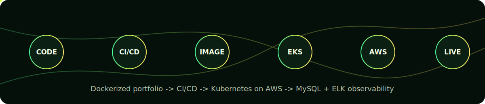
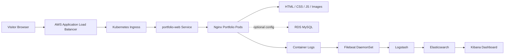
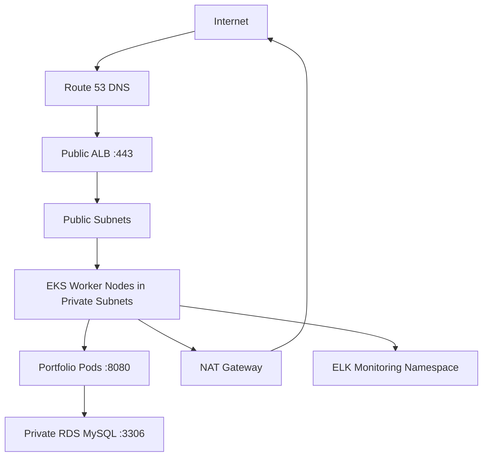
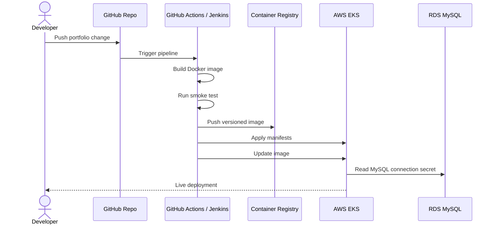

# Muhammad Kashif DevOps Portfolio



Production-ready DevOps package for the portfolio website. It includes Docker, Kubernetes, AWS Terraform, GitHub Actions, Jenkins CI/CD, MySQL/RDS integration, and ELK-style log monitoring.

> Cost warning: AWS EKS, NAT Gateway, RDS, load balancers, and related networking can create real charges. Create an AWS Budget before deploying and run `terraform destroy` when you are done testing.

## Stack

| Layer | Tooling |
|---|---|
| Website | Static HTML, CSS, JavaScript |
| Container | Docker + Nginx |
| Local dev | Docker Compose + MySQL |
| Cloud | AWS |
| Infrastructure | Terraform |
| Runtime | EKS Kubernetes |
| Database | RDS MySQL |
| CI/CD | GitHub Actions and Jenkins |
| Monitoring | Elasticsearch, Logstash, Kibana, Filebeat |

## Data Flow



## Network Flow



## CI/CD Flow



## Project Structure

```text
.
├── Dockerfile
├── docker-compose.yml
├── Jenkinsfile
├── .github/workflows/ci-cd.yml
├── k8s/
│   ├── base/
│   └── overlays/
├── terraform/aws/
│   ├── modules/
│   └── terraform.tfvars.example
├── monitoring/
│   ├── elk/
│   └── filebeat/
├── docs/
└── index.html
```

## Local Docker Run

Start Docker Desktop first. Wait until it says Docker is running.

```powershell
docker version
```

Run the portfolio locally:

```powershell
docker compose up --build -d
```

Open:

```text
http://127.0.0.1:8080
```

Health check:

```powershell
Invoke-RestMethod http://127.0.0.1:8080/healthz
```

Stop:

```powershell
docker compose down
```

If Docker says it cannot connect to `dockerDesktopLinuxEngine`, open Docker Desktop, switch to Linux containers if needed, then retry.

## Install Required Tools On Windows

Check tools:

```powershell
aws --version
terraform -version
kubectl version --client
docker version
git --version
```

Install missing tools:

```powershell
winget install Amazon.AWSCLI
winget install Hashicorp.Terraform
winget install Kubernetes.kubectl
winget install Docker.DockerDesktop
winget install Git.Git
```

Close PowerShell and open a new one after installing. If `aws` is still not recognized, download the AWS CLI MSI:

```text
https://awscli.amazonaws.com/AWSCLIV2.msi
```

## Configure AWS CLI

Create an IAM user/access key in AWS, then run:

```powershell
aws configure
```

Enter:

```text
AWS Access Key ID: your-access-key
AWS Secret Access Key: your-secret-key
Default region name: us-east-1
Default output format: json
```

Test:

```powershell
aws sts get-caller-identity
```

If this returns your AWS account ID, AWS CLI is configured.

## Create Terraform Backend

Terraform remote state needs:

- S3 bucket for state
- DynamoDB table for locking

Set region and account values:

```powershell
$env:AWS_REGION="us-east-1"
$accountId = aws sts get-caller-identity --query Account --output text
$bucket = "devops-portfolio-tfstate-$accountId"
$table = "devops-portfolio-tf-locks"
```

Create the S3 bucket:

```powershell
aws s3api create-bucket --bucket $bucket --region $env:AWS_REGION
```

Enable versioning:

```powershell
aws s3api put-bucket-versioning `
  --bucket $bucket `
  --versioning-configuration Status=Enabled
```

Enable encryption:

```powershell
$encryption = '{"Rules":[{"ApplyServerSideEncryptionByDefault":{"SSEAlgorithm":"AES256"}}]}'

aws s3api put-bucket-encryption `
  --bucket $bucket `
  --server-side-encryption-configuration $encryption
```

Block public access:

```powershell
aws s3api put-public-access-block `
  --bucket $bucket `
  --public-access-block-configuration BlockPublicAcls=true,IgnorePublicAcls=true,BlockPublicPolicy=true,RestrictPublicBuckets=true
```

Create the DynamoDB lock table:

```powershell
aws dynamodb create-table `
  --table-name $table `
  --attribute-definitions AttributeName=LockID,AttributeType=S `
  --key-schema AttributeName=LockID,KeyType=HASH `
  --billing-mode PAY_PER_REQUEST `
  --region $env:AWS_REGION
```

Wait for it:

```powershell
aws dynamodb wait table-exists --table-name $table --region $env:AWS_REGION
```

## Edit Terraform Backend

Open:

```powershell
notepad terraform\aws\versions.tf
```

Replace:

```hcl
bucket         = "replace-with-your-terraform-state-bucket"
dynamodb_table = "replace-with-your-terraform-lock-table"
```

With your real values:

```hcl
bucket         = "devops-portfolio-tfstate-123456789012"
dynamodb_table = "devops-portfolio-tf-locks"
```

Example:

```hcl
backend "s3" {
  bucket         = "devops-portfolio-tfstate-123456789012"
  key            = "portfolio/prod/terraform.tfstate"
  region         = "us-east-1"
  dynamodb_table = "devops-portfolio-tf-locks"
  encrypt        = true
}
```

## Create terraform.tfvars

Copy the example:

```powershell
Copy-Item terraform\aws\terraform.tfvars.example terraform\aws\terraform.tfvars
notepad terraform\aws\terraform.tfvars
```

Minimum values to review:

```hcl
project_name = "devops-portfolio"
environment  = "prod"
aws_region   = "us-east-1"

mysql_database = "portfolio"
mysql_username = "portfolio_admin"
mysql_password = "your-long-secure-password-here"
```

Generate a random password:

```powershell
-join ((48..57)+(65..90)+(97..122) | Get-Random -Count 28 | ForEach-Object {[char]$_})
```

Do not commit `terraform.tfvars`. It is ignored by `.gitignore`.

## Run Terraform

From project root:

```powershell
cd terraform\aws
terraform init
terraform validate
terraform plan
terraform apply
```

Type `yes` when Terraform asks for confirmation.

When it finishes, configure kubectl:

```powershell
aws eks update-kubeconfig --region us-east-1 --name devops-portfolio-prod-eks
kubectl get nodes
```

## Kubernetes Deploy

Set deployment values:

```powershell
$env:IMAGE="ghcr.io/muhammad-kashif-ijaz/devops-portfolio-full-ready:latest"
$env:MYSQL_HOST="your-rds-endpoint"
$env:MYSQL_DATABASE="portfolio"
$env:MYSQL_USERNAME="portfolio_admin"
$env:MYSQL_PASSWORD="your-rds-password"
```

Deploy:

```powershell
.\scripts\deploy-k8s.ps1
```

Linux/macOS equivalent:

```bash
export IMAGE="ghcr.io/muhammad-kashif-ijaz/devops-portfolio-full-ready:latest"
export MYSQL_HOST="your-rds-endpoint"
export MYSQL_DATABASE="portfolio"
export MYSQL_USERNAME="portfolio_admin"
export MYSQL_PASSWORD="your-rds-password"
sh ./scripts/deploy-k8s.sh
```

## GitHub Actions Setup

Pipeline:

```text
.github/workflows/ci-cd.yml
```

Create these GitHub repository secrets:

```text
AWS_ACCESS_KEY_ID
AWS_SECRET_ACCESS_KEY
AWS_REGION
EKS_CLUSTER_NAME
MYSQL_HOST
MYSQL_DATABASE
MYSQL_USERNAME
MYSQL_PASSWORD
```

See:

```text
docs/github-secrets.md
```

Push to `main` to trigger the pipeline.

Important: GHCR image paths must be lowercase. The workflow automatically converts your GitHub repo path to lowercase.

## Jenkins Setup

Pipeline:

```text
Jenkinsfile
```

Create Jenkins credentials:

```text
docs/jenkins-credentials.md
```

Required Jenkins agent tools:

- Docker
- AWS CLI
- kubectl
- Git
- Terraform if Jenkins will run infrastructure jobs

Create a Jenkins Pipeline job pointing to this GitHub repo.

## ELK Monitoring

Local ELK:

```powershell
cd monitoring\elk
docker compose -f docker-compose.elk.yml up -d
```

Open Kibana:

```text
http://127.0.0.1:5601
```

Kubernetes Filebeat:

```powershell
kubectl apply -f monitoring\filebeat\filebeat-daemonset.yaml
```

## Important Values To Replace

Search the repo for:

```text
your-github-user
portfolio.example.com
dev.portfolio.example.com
replace-me
replace-with-your-terraform-state-bucket
replace-with-your-terraform-lock-table
replace-with-a-long-password
```

## Common Fixes

### `aws` is not recognized

Install AWS CLI:

```powershell
winget install Amazon.AWSCLI
```

Close PowerShell, open a new one, then:

```powershell
aws --version
aws configure
```

### Docker cannot connect to engine

Open Docker Desktop and wait until it is running. Then:

```powershell
docker version
docker compose up --build -d
```

### GitHub Actions invalid Docker tag

Docker/GHCR image names must be lowercase. This repo already fixes that in `.github/workflows/ci-cd.yml`.

### GitHub Actions smoke test permission denied

This repo runs the smoke test with:

```bash
sh ./scripts/smoke-test.sh
```

So it does not depend on Linux executable permissions.

## Cleanup AWS Resources

To avoid ongoing cost:

```powershell
cd terraform\aws
terraform destroy
```

Type `yes` when prompted.

After destroying infrastructure, you may also delete old GHCR images and local Docker containers if desired.
