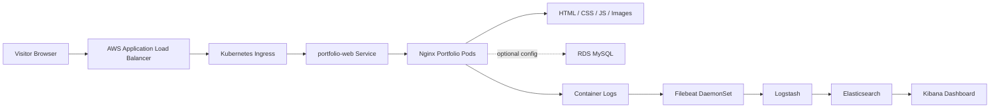
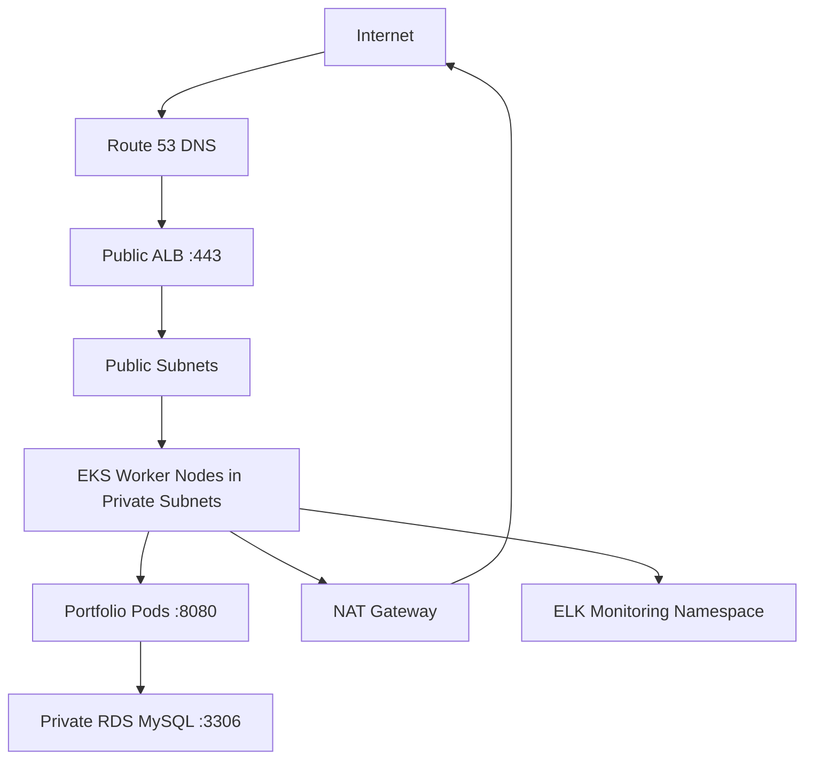
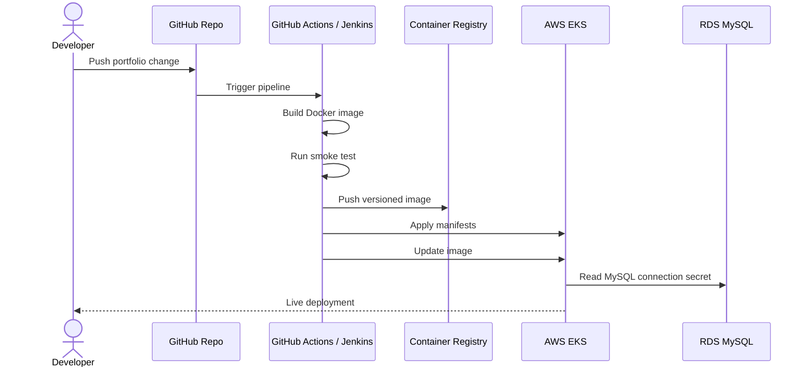

# Muhammad Kashif DevOps Portfolio


Production-ready DevOps package for the portfolio website. It includes Docker, Kubernetes, AWS Terraform, GitHub Actions, Jenkins CI/CD, MySQL/RDS integration, and ELK-style log monitoring.

## Stack

| Layer | Tooling |
|---|---|
| Website | Static HTML, CSS, JavaScript |
| Container | Docker + Nginx |
| Local dev | Docker Compose + MySQL |
| Cloud | AWS |
| Infrastructure | Terraform |
| Runtime | EKS Kubernetes |
| Database | RDS MySQL |
| CI/CD | GitHub Actions and Jenkins |
| Monitoring | Elasticsearch, Logstash, Kibana, Filebeat |

## Data Flow



## Network Flow



## CI/CD Flow



## Local Run

```bash
docker compose up --build -d
curl http://127.0.0.1:8080/healthz
```

Open:

```text
http://127.0.0.1:8080
```

Stop:

```bash
docker compose down
```

## AWS Setup

1. Create an AWS account or use your existing one.
2. Install `aws`, `terraform`, `kubectl`, `docker`, and `git`.
3. Create an S3 bucket and DynamoDB lock table for Terraform state.
4. Edit `terraform/aws/versions.tf` and replace the backend bucket/table.
5. Copy `terraform/aws/terraform.tfvars.example` to `terraform/aws/terraform.tfvars`.
6. Put your real MySQL password in `terraform.tfvars`.
7. Run:

```bash
cd terraform/aws
terraform init
terraform plan
terraform apply
```

8. Configure kubectl:

```bash
aws eks update-kubeconfig --region us-east-1 --name devops-portfolio-prod-eks
```

## Kubernetes Deploy

Set these values:

```bash
export IMAGE="ghcr.io/muhammad-kashif-ijaz/devops-portfolio-full-ready:latest"
export MYSQL_HOST="your-rds-endpoint"
export MYSQL_DATABASE="portfolio"
export MYSQL_USERNAME="portfolio_admin"
export MYSQL_PASSWORD="your-rds-password"
```

Deploy:

```bash
./scripts/deploy-k8s.sh
```

On Windows PowerShell:

```powershell
$env:IMAGE="ghcr.io/muhammad-kashif-ijaz/devops-portfolio-full-ready:latest"
$env:MYSQL_HOST="your-rds-endpoint"
$env:MYSQL_DATABASE="portfolio"
$env:MYSQL_USERNAME="portfolio_admin"
$env:MYSQL_PASSWORD="your-rds-password"
.\scripts\deploy-k8s.ps1
```

## GitHub Actions

Pipeline file:

```text
.github/workflows/ci-cd.yml
```

Create secrets from:

```text
docs/github-secrets.md
```

Then push to `main` or `master`.

## Jenkins

Pipeline file:

```text
Jenkinsfile
```

Create Jenkins credentials from:

```text
docs/jenkins-credentials.md
```

Then create a Pipeline job pointing to your Git repository.

## ELK Monitoring

Local ELK:

```bash
cd monitoring/elk
docker compose -f docker-compose.elk.yml up -d
```

Kibana:

```text
http://127.0.0.1:5601
```

Kubernetes Filebeat:

```bash
kubectl apply -f monitoring/filebeat/filebeat-daemonset.yaml
```

## Important Values To Replace

Search the repo for these placeholders:

```text
your-github-user
portfolio.example.com
dev.portfolio.example.com
replace-me
replace-with-your-terraform-state-bucket
replace-with-your-terraform-lock-table
replace-with-a-long-password
```

GHCR image paths must be lowercase. The GitHub Actions pipeline automatically converts your repo path to lowercase before building the Docker image.

## What You Configure

- AWS credentials in GitHub/Jenkins.
- Terraform backend S3 bucket and DynamoDB table.
- `terraform.tfvars` for AWS region, EKS size, and MySQL password.
- Domain and ACM certificate ARN in `k8s/base/ingress.yaml`.
- Container image repository in CI/CD and Kubernetes overlays.
- Jenkins credentials listed in `docs/jenkins-credentials.md`.
- GitHub Actions secrets listed in `docs/github-secrets.md`.
